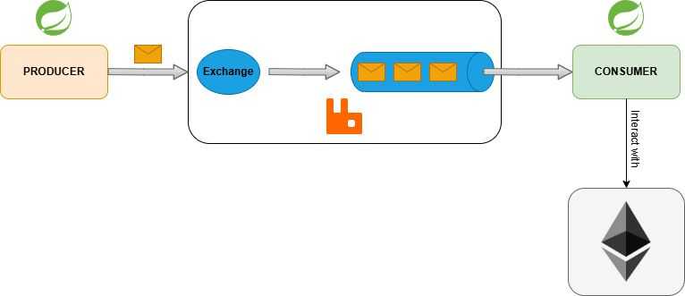

# Asynchronous Microservices Communication with Ethereum Blockchain

## Project Overview

This project implements two asynchronous microservices that communicate via RabbitMQ. The first microservice is responsible for generating different types of messages, while the second one processes the received messages and takes action based on the message type.

The core functionality of the second microservice includes generating a hash from the data in the received message, sending this hash to the Ethereum blockchain via a transaction, and returning the time it took for the transaction to be accepted by the network.

## Architecture Diagram

## Technologies Used

The following technologies were utilized to develop this project:

- **Spring Boot**: A framework used to build the two microservices.
- **RabbitMQ**: An asynchronous messaging system used to ensure communication between the two microservices.
- **Bucket4j**: A library used to implement a rate-limiting mechanism based on the token-bucket algorithm.
- **Web3j**: A Java library that provides an interface to interact with the Ethereum blockchain.
- **Docker**: Used to containerize the application.

## Features

- **Microservice 1 (Producer)**: Generates messages asynchronously and sends them to RabbitMQ.
- **Microservice 2 (Consumer)**: Processes incoming messages, generates a hash from the message data, and sends the hash to the Ethereum blockchain.
- **Transaction Confirmation**: The consumer waits for the transaction to be confirmed on the Ethereum network and returns the time taken for the transaction to be accepted.
- **Rate Limiting**: The system uses a rate-limiting mechanism based on the token-bucket algorithm to control the number of requests that can be made to the blockchain within a given time period.

## Configuration

It is essential to configure the private key of the account that will be used to interact with the blockchain in the `application.properties` file. You will also need to specify the Ethereum node to connect to within the same file.

1. Open the `application.properties` file.
2. Set the **private key** for the account that will interact with the Ethereum blockchain.
3. Set the **Ethereum node URL** (e.g., Infura, a local Ethereum node, etc.).
